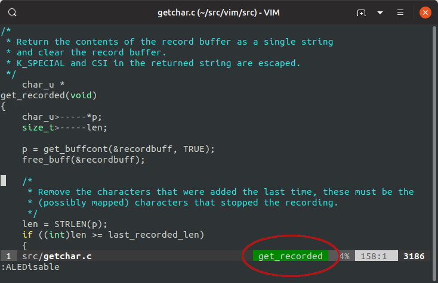

Overview
--------

Vim plugin to show the name of the current tag (usually function) in the status
line.

Inspired by Michal Vitecek's pythonhelper.vim_ and my chelper.vim_.  Intended
to replace both of them.

Needs Vim 8.0.0251 or newer, built with Python support.

Supports multiple languages:

- Python
- C
- C++
- diff files

Doesn't actually use tags files -- instead it has its own hacky parsers.

.. _pythonhelper.vim: https://www.vim.org/scripts/script.php?script_id=435
.. _chelper.vim: https://github.com/mgedmin/chelper.vim

Installation
------------

I suggest you use a plugin manager like vim-plug_::

  " your vimrc

  ...

  call plug#begin()
    ...
  Plug 'mgedmin/taghelper.vim'
    ...
  call plug#end()

.. _vim-plug: https://github.com/junegunn/vim-plug

Configuration
-------------

Add ``%{taghelper#curtag()}`` to your 'statusline', e.g. ::

  set statusline=%<%f\ %h%m%r\ %1*%{taghelper#curtag()}%*%=%-14.(%l,%c%V%)\ %P

Debugging
---------

``:call taghelper#showtags()`` will print all the tags detected in a source
file.  If you find that some code is parsed incorrectly (my parser is really
simple!), please file a bug on GitHub.

Copyright
---------

``taghelper.vim`` was written by Marius Gedminas <marius@gedmin.as>.
Licence: MIT.
