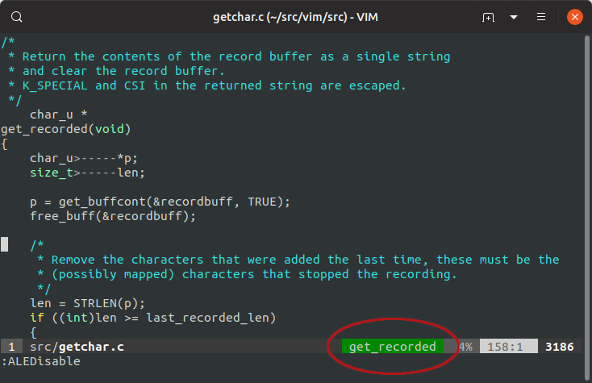

Overview
--------

.. image:: https://github.com/mgedmin/taghelper.vim/actions/workflows/build.yml/badge.svg?branch=master
    :target: https://github.com/mgedmin/taghelper.vim/actions

Vim plugin to show the name of the current tag (usually function) in the status
line.

Inspired by Michal Vitecek's pythonhelper.vim_ and my chelper.vim_.  Intended
to replace both of them.

Needs Vim 8.0.0251 or newer, built with Python support.

Supports multiple languages:

- Python
- C
- C++
- diff files
- .ini files
- Robot Framework test files
- Vim help files

Doesn't actually use tags files -- instead it has its own hacky parsers.

.. _pythonhelper.vim: https://www.vim.org/scripts/script.php?script_id=435
.. _chelper.vim: https://github.com/mgedmin/chelper.vim

Installation
------------

I suggest you use a plugin manager like vim-plug_::

  Plug 'mgedmin/taghelper.vim'

.. _vim-plug: https://github.com/junegunn/vim-plug

Configuration
-------------

Add ``%{taghelper#curtag()}`` to your 'statusline', e.g. ::

  set statusline=%<%f\ %h%m%r\ %1*%{taghelper#curtag()}%*%=%-14.(%l,%c%V%)\ %P

Extensibility
-------------

Create a ``taghelper_yourlanguage.py`` in ~/.vim/pythonx or inside a ./pythonx/
directory of any plugin on &runtimepath, with the following contents::

  TAGHELPER_PLUGIN_API_VERSION = 1
  TAGHELPER_SYNTAX = 'yourlanguage'

  def parse(buffer, tags):
      for lineno, line in enumerate(buffer, 1):
          if line.startswith('def '):
              name = line.removeprefix('def ').strip()
              tags.add(name, lineno, autoclose=True)

Adjust the parsing code as desired.

The ``buffer`` object is a vim.Buffer, as described in Vim's ``:help
python-buffer``.  The ``tags`` object is a taghelper.Tags and it has the
following methods:

- def add(name, firstlineno, lastlineno=None, autoclose=False)

  Define a new tag starting on firstlineno.  If lastlineno is not specified,
  the tag extends until the end of the buffer.  You can change the lastlineno
  later.

  If autoclose is True, calls tags.autoclose(firstlineno - 1) before adding the
  new tag.

  Returns the tag object (so you can change the lastlineno later).

- def autoclose(lastlineno=None, all=False)

  Set the lastlineno for all recently added tags that don't have a lastlineno
  set.  Stops at the most recent tag that does have a lastlineno set.

  If all is True, sets lastlineno for _all_ tags that don't have lastlineno
  set, not just for the most recent ones.

All line numbers are 1-based.

Debugging
---------

``:call taghelper#showtags()`` will print all the tags detected in a source
file.  If you find that some code is parsed incorrectly (my parser is really
simple!), please file a bug on GitHub.

``:verbose call taghelper#showtags()`` will show whether it's parsing the
buffer fresh (and using which syntax parser), or whether it's reusing a cached
Tags object.

``:call taghelper#refresh()`` will clear all caches and recompute the current
tag.

``:call taghelper#reimport()`` will reload the Python code for all the parsers.

``:verbose call taghelper#loadplugins()`` will show which plugin files were
detected and loaded (and which ones failed to load).  It's normal and expected
for this to list the builtin parsers as unsupported plugins that don't set the
TAGHELPER_PLUGIN_API_VERSION.

Copyright
---------

``taghelper.vim`` was written by Marius Gedminas <marius@gedmin.as>.
Licence: MIT.
